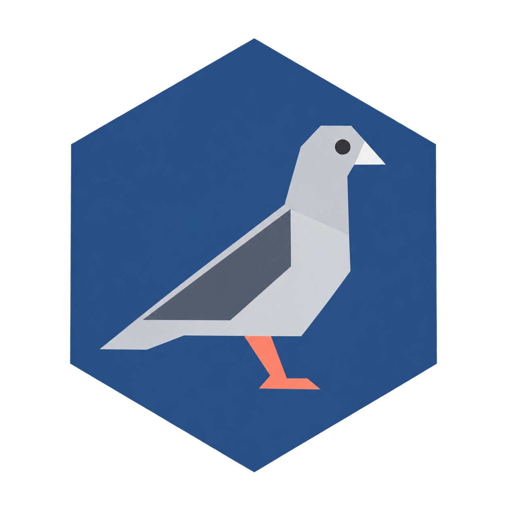

# Pigeon Connect

*Last updated: September 23, 2026*

**Team Members:**

* Peter Brumbach
* John Bauer
* Ella Kocher
* Alissa Hoover
* Lucas Sanderson

## Introduction

Pigeon Connect is a school communication system being developed for Central Christian Academy in Houston, Pennsylvania. The primary users are teachers, parents, and relevant school faculty and administrators. The system is intended to provide a centralized way for school staff and parents to communicate while keeping important student information accessible and up to date.

The primary features of Pigeon Connect include student transportation management, communication between teachers and parents, and notifications distributed through multiple channels. Parents will be able to update their children's transportation arrangements, while teachers and administrators will be able to review and approve transportation changes. The system will also allow teachers and administrators to communicate with individual parents, groups of parents, or the entire school community when necessary.

## Representative Tasks

The representative tasks below describe realistic situations that Pigeon Connect is intended to support. They focus on the goals of teachers, parents, and school administrators rather than prescribing a particular interface. These tasks reflect important communication and transportation needs that the current school application is intended to address.

* **MVP:** Administrators can communicate with the entire school community.

  * Lisa is an administrator at the school and learns that the date of the upcoming Christmas concert has changed. She needs to notify parents, teachers, and other administrators of the new date so that everyone has accurate information about the event. Lisa creates a notification containing the updated information and distributes it to the appropriate members of the school community.

* **MVP:** Teachers can communicate with the parents of students in their class.

  * Mark is a science teacher who plans to conduct an experiment involving paper towel rolls during his third-period class on Friday. Because students need to bring paper towel rolls from home, Mark wants to notify the parents of students in that particular class several days in advance. He sends a notification specifically to the parents of his third-period students rather than sending it to all of his science classes.

* **MVP:** Teachers can communicate with the parents of an individual student.

  * Amanda Bright has been struggling in her sixth-grade mathematics class. Her teacher, Ms. Roller, wants to discuss possible ways to provide additional support for Amanda. Ms. Roller needs to communicate privately with Amanda's parents so that they can discuss the situation and possible options without involving the parents of other students.

* **MVP:** Parents can receive school communications through the app, email, or printed form.

  * Mary and John prefer to keep physical copies of important school information so that they can post them in their home. When using Pigeon Connect, they can receive school notifications through the application, by email, or in a printable format. When their son's teacher sends information about an upcoming event or important date, Mary and John can print the notification and keep it with their household calendar.

* **MVP:** Parents can communicate a change in transportation arrangements for their child.

  * Holly's father has an unexpected work obligation that requires him to travel out of town. Because he will not be home when Holly normally arrives from school, he arranges for Holly's grandparents to care for her for the next several days. He needs to notify the school that Holly should be picked up by her grandparents instead of taking the bus home. He submits the transportation change through Pigeon Connect so that the school can review the updated arrangement.

* **MVP:** Teachers can view the transportation status of their students from the application dashboard.

  * At the end of the school day, Mr. Smith, the homeroom teacher for a tenth-grade class, needs to organize his students according to their transportation arrangements. He reviews the transportation status of each student on the application dashboard. He sees that Holly's transportation status has changed from bus transportation to parent pickup, allowing him to place her with the appropriate group of students and prevent her from being sent to the bus.

* **MVP:** Two approvals from teachers or administrators are required before a student's transportation status is officially updated.

  * Holly's father notifies the school that Holly needs to be picked up by her grandparents instead of taking the bus. Lisa, the administrator who receives the request, creates a transportation status change request and provides the first approval. Mr. Smith, Holly's homeroom teacher, reviews the request and provides the second approval. Once both approvals have been received, Holly's transportation status is updated from bus transportation to parent pickup for that day.

* **MVP:** At the end of the school year, the application's database can be archived and prepared for the following school year while preserving necessary information.

  * At the end of the school year, Steve, the school's IT administrator, prepares the system for the following year. He archives the records from the current school year and clears information that is no longer needed for active use. This prevents parents from continuing to receive notifications associated with their children's previous classes while allowing necessary records to be retained. Steve also ensures that information for newly enrolled students and their parents can be added for the upcoming school year and that graduated students are no longer included in the active student database.

## Related Work

Several existing applications provide communication, transportation, or school-management features related to Pigeon Connect. Examining these systems helps identify interaction patterns and functionality that may be appropriate for the school's needs while also identifying features that are outside the intended scope of Pigeon Connect.

### ClassDojo

ClassDojo is a website and application that supports communication between teachers, students, and parents. It provides features such as teacher-created calendar events and the ability to send images and other information that parents can view and interact with. These communication capabilities overlap with Pigeon Connect's goal of providing teachers and school staff with a way to communicate important information to parents.

ClassDojo also includes features that are outside the current scope of Pigeon Connect. For example, teachers can award students points for behavior that parents can view. Pigeon Connect will instead focus on school-to-parent communication and transportation management. In particular, Pigeon Connect will provide school staff with tools for communicating transportation changes and reviewing those changes.

ClassDojo also provides different communication options, including paid features. Pigeon Connect is intended to provide communication capabilities that are specifically tailored to the school's needs. For example, transportation changes submitted by parents will require review by appropriate school staff before they become official. This supports the transportation-related representative tasks described above and gives school staff a way to verify changes before they affect end-of-day student dismissal.

ClassDojo's interface also provides an example of a clean and approachable design for school communication software. Examining this interface can help inform Pigeon Connect's communication features while keeping the system focused on the specific needs of the school.

### Pikmykid

Pikmykid is a school safety and dismissal-management platform that provides features related to student transportation, including tools for managing dismissal, student hall passes, and emergency reunification. Its transportation functionality is particularly relevant to Pigeon Connect because it allows parents to communicate changes to how their children will leave school.

For example, Pikmykid allows parents to make same-day or future changes to their child's transportation arrangements, such as indicating that a student will be picked up by a parent rather than taking the bus. Pigeon Connect will support a similar task while also incorporating communication features between parents, teachers, and school administrators.

Pikmykid also provides functionality for ensuring that students are released to the correct adults and for allowing parents to check in when they arrive to pick up their children. These features may provide useful ideas for future improvements to Pigeon Connect as the team gathers additional information from teachers and administrators at the school. They are not currently part of the primary scope of the application.

A significant difference is that Pikmykid is a commercial platform that schools must purchase, whereas Pigeon Connect is being developed specifically for the client's requirements. This allows the project to focus on the transportation and communication functions that Central Christian Academy identifies as important rather than requiring the school to adopt a larger set of features.

### School Dismissal Manager

School Dismissal Manager is an application focused specifically on managing student transportation and dismissal. It allows parents to update their children's transportation arrangements and provides tools for managing student pickup. It also provides notifications related to transportation changes.

These capabilities overlap with Pigeon Connect's transportation functionality. Both systems allow parents to communicate transportation changes and provide school staff with information about those changes. However, the systems differ in how transportation changes are communicated and reviewed.

School Dismissal Manager can notify teachers about transportation changes at the end of the school day. Pigeon Connect is intended to support a review process in which transportation changes require approval from teachers or administrators before the student's official transportation status changes. This directly supports the representative task in which two school staff members review a parent's transportation request.

School Dismissal Manager also provides administrators with the ability to establish a deadline after which parents can no longer make transportation changes. This is a potentially useful feature for Pigeon Connect because it could help prevent late transportation changes from disrupting the dismissal process.

Unlike School Dismissal Manager, Pigeon Connect is intended to combine transportation management with broader communication between parents and school staff. This would allow the school to address transportation and general communication needs through the same system rather than requiring separate applications for those functions.

### Seesaw

Seesaw is an application and website that provides educational resources and communication tools for schools. It includes teacher-led learning activities, student resources, parent-teacher communication, and other educational features. Although Pigeon Connect will not attempt to provide Seesaw's full set of educational capabilities, its communication features are relevant to the proposed system.

Seesaw allows teachers to send reminders and communicate with parents through the application. It also supports two-way messaging between teachers and parents, which is similar to Pigeon Connect's goal of allowing teachers to communicate with individual students' parents when a private conversation is necessary.

Seesaw also provides features such as analytics related to student performance and message translation. Student-performance analytics are outside the current scope of Pigeon Connect, although the concept of providing analytics could potentially inform future features for examining communication or transportation activity. Translation functionality may also be useful in the future because it could help make communication more accessible to families who speak different languages.

The primary distinction between Seesaw and Pigeon Connect is the focus of each system. Seesaw is designed as a broader educational platform, while Pigeon Connect is specifically focused on communication between school staff and parents and on managing student transportation. Examining Seesaw therefore provides useful examples of parent-teacher communication without requiring Pigeon Connect to adopt its broader educational functionality.

## Bibliography

ClassDojo. "ClassDojo Plus." *ClassDojo*, https://www.classdojo.com/plus/. Accessed 20 Sept. 2026.

Pikmykid. "Dismissal Management." *Pikmykid*, https://www.pikmykid.com/solutions/dismissal-management. Accessed 20 Sept. 2026.

SchoolDismissalManager. "How It Works." *SchoolDismissalManager*, https://www.schooldismissalmanager.com/HowItWorks.aspx. Accessed 20 Sept. 2026.

Seesaw. "Seesaw." *Seesaw*, https://seesaw.com/. Accessed 20 Sept. 2026.
